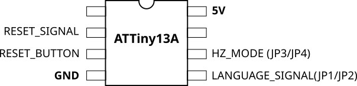
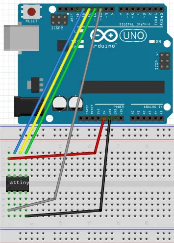

Megadrive Tiny Switchless region mod

The mod uses Arduino framework and could be used with various devices that supports it.

To build this and flash to the IC you'll need Arduino IDE.

I used AtTiny13A as the microcontroller for this.

To flash the program to IC you can use Arduino Uno connected like this:

